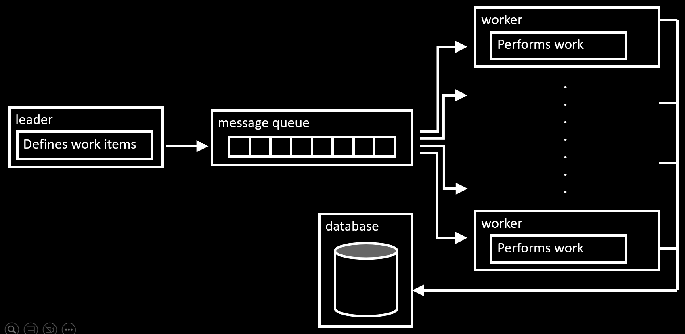

---

marp: true
title: Demo distributed computing
paginate: true
theme: default

---
<!-- class: invert -->
# Demo distributed computing

---

# Monolithic architecture

Complete software product runs in one single application, on one machine.

---

# Microservice architecture

Software product is split into component, and can run across different machines.

---

# Current situation

The following steps are performed in a single application

* Building topology
* Defining work load (selections)
* With a for loop, running the calculation per selection
* Exporting output data

---

# Architecture



---

# Process


--- 

# In this demo


--- 

# Code Structure


---

# Message

* `run_id` is the id of the entire run
* `task_id` is the id of a single task or work item
* `selection`, `start_date`, `end_date` define the specifics of the work item

```
{
    'run_id': 'c1ab55ca-27d5-40e7-9899-e475f906af1c',
    'task_id': '0ce41899-a414-4920-9159-ccf223840634'
    'selection': '1',
    'start_date': '2023-01-01 00:00',
    'end_date': '2023-01-31 23:59',
}
```

---

# Process Table


---

# Setup of demo

* Applications running in Docker containers
    * worker, leader
      * written in Python
    * RabbitMQ
      * open source message broker
      * base image rabbitmq
    * MySQL
      * Relational Database with 1 table


---

# Setup of demo

* Orchestrated with Docker Compose
* Run the whole stack with `docker compose up`

---

# Implementation on Openshift

* leader: like the original application, cronjob with the original schedule
* queue: deploymentconfig with constant instance of 1
* worker: deploymentconfig that scales instances based on items in the queue
    * https://github.com/onfido/k8s-rabbit-pod-autoscaler

---

# First steps

* Openshift implementation with 'trivial' leader, message queue and current application as a single instance worker
* Implement handling of the process with the run process table
* Move building of topology into leader
* Manually scale up worker
* Implement autoscaling of workers

---

# Further steps

* Building of topology in separate application
* Polling for process completion in separate application
* ...
